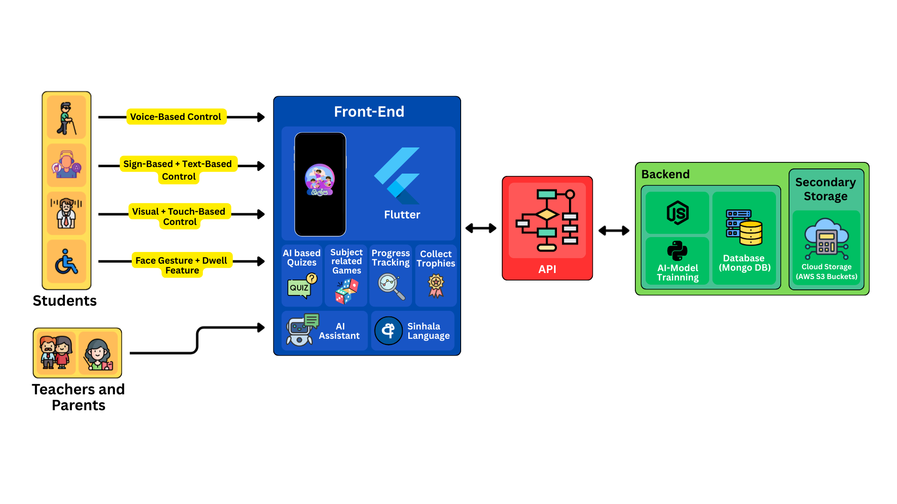
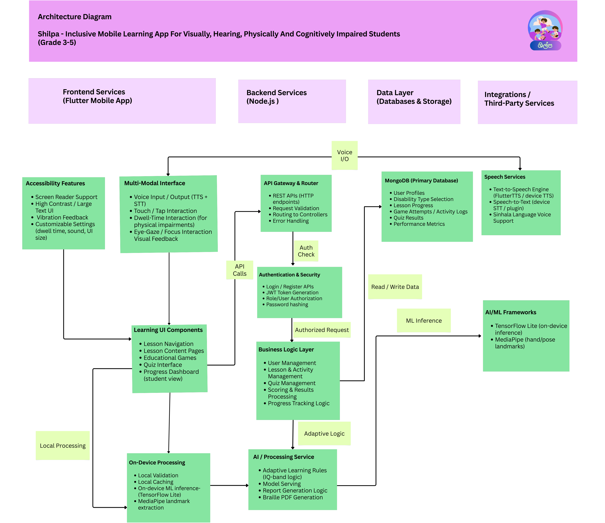

# Shilpa – Inclusive Mobile Learning Application

## Project Description
Shilpa is a cross-platform mobile learning application created to support Sri Lankan primary school students in Grades 3–5 who experience visual, hearing, physical, or cognitive learning difficulties.  
The system is designed to provide accessible, localized, and independent learning using Sinhala-language content and adaptive technology.

The application combines multiple accessibility methods such as voice interaction, sign language support, gesture-based control, and adaptive learning strategies into a single unified platform.

---

## Project Objective
The objective of this project is to develop one inclusive mobile learning platform that ensures fair and personalized education for students with multiple disabilities by using adaptive technologies, voice interaction, sign language, gesture control, and cognitive-friendly learning experiences.

---

## Project Team
- Wijesooriya C.D. – Visual Impairment Support  
- Thanthirige K.S.G.I. – Hearing Impairment Support  
- Perera G.W.R.S. – Physical Impairment Support  
- Mathota Arachchi S.S. – Cognitive and Learning Difficulties Support  

**Supervisor:** Prof. Nuwan Kodagoda  
**Co-Supervisor:** Mrs. Jenny Krishara  

---

## Problem Statement
Many existing educational applications are designed to support only a single disability type and often lack Sinhala or Tamil language support.  
In addition, most platforms are not aligned with the Sri Lankan primary school curriculum and do not support alternative interaction methods required by children with special educational needs.

Current solutions rarely combine voice guidance, sign language interaction, gesture-based control, adaptive difficulty adjustment, and gamified learning within one system.  
Shilpa addresses these limitations by providing a single inclusive platform that integrates these features to support independent learning.

---

## Functional Modules

### Visual Impairment Support
- Voice-based navigation using Text-to-Speech and Speech-to-Text  
- Spatial audio support for storytelling and lessons  
- Vibration feedback  
- AI-assisted generation of Braille-ready learning materials  
- Compatibility with screen readers  
- Progress tracking for teachers and parents  

### Hearing Impairment Support
- Lessons delivered using Sri Lankan Sign Language  
- Pose estimation for sign recognition and feedback  
- Interactive sign imitation games  
- Animated visual lessons  
- Progress tracking  

### Physical Impairment Support
- Voice commands, gaze tracking, and facial gesture-based control  
- Dwell-time activation with adjustable interaction timing  
- Safety features such as countdown indicators and stop commands  
- AI-based assistant with motivational feedback  
- Reward system to encourage engagement  
- Progress tracking  

### Cognitive and Learning Difficulties Support
- Adaptive lessons based on learner ability levels  
- Gamified micro-learning activities  
- Animated emotional guidance and step-by-step support  
- Adaptive difficulty adjustment  
- Simple, user-friendly lesson design  
- Progress tracking  

---

## System Overview Diagram
The system overview diagram provides a high-level view of the Shilpa application, showing the main components and their interactions.



---

## System Architecture
The system architecture diagram illustrates the detailed structure of the application, including frontend services, backend APIs, AI/ML components, database layer, and integrations.



### Architecture Layers
1. User interaction layer for voice, sign, gesture, and touch input  
2. Application logic layer managing lessons, games, and quizzes  
3. AI and accessibility layer providing adaptive guidance and inference  
4. Database layer for user profiles and progress data  
5. Security layer with authentication and authorization  

---

## Technologies Used

### Frontend
- Flutter (Dart)

### Backend
- Node.js  
- Express.js  
- TypeScript  

### Database
- MongoDB  

### AI / ML
- TensorFlow Lite (on-device inference)  
- MediaPipe (hand and pose landmark detection)  

### Design & Documentation
- Figma  
- draw.io  

---

## Dependencies

### Frontend Dependencies (Flutter)
- flutter_tts  
- speech_to_text  
- camera  
- vibration  
- http  
- provider  

### Backend Dependencies (Node.js)
- express  
- mongoose  
- jsonwebtoken  
- bcrypt  
- cors  
- zod  
- dotenv  
- nodemon  

### AI / ML Dependencies
- TensorFlow Lite  
- MediaPipe  

---

## Data Collection
Field research and usability testing were carried out at:
- School for the Blind, Tangalle  
- School for the Deaf, Sitinamaluwa, Beliatta  
- National Institute of Education (NIE), Maharagama  

Data was collected through interviews and observations involving teachers, parents, and students, focusing on accessibility needs and effective learning interactions.

---

## Expected Outcomes
- An inclusive mobile learning application supporting multiple disability categories  
- Improved learner confidence, independence, and engagement  
- Localized AI-driven learning support  
- Enhanced inclusivity in Sri Lankan primary education  


## Repository Structure
```
ShilpaMobileLearningApp/
├── README.md
├── mobile_app/ # Flutter frontend
│ └── README.md
├── backend/ # Node.js backend
│ └── README.md
├── ml/ # Machine learning resources
└── docs/
    └── architecture/ # System diagrams
```

## Installation and Setup

### Clone the Repository
```bash
git clone https://github.com/gimashi123/ShilpaMobileLearningApp.git
```

## Setup Guidance

This project contains separate modules for the mobile frontend and backend services.

- **Frontend setup instructions** are provided in:  
  `mobile_app/README.md`

- **Backend setup instructions** are provided in:  
  `backend/README.md`

After cloning the repository, refer to the module-specific README files for detailed setup instructions.
